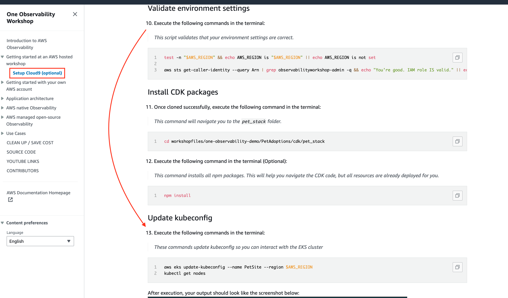

# Environment Setup

## Workshop Environment

1. Setup cloud9 by follow on [Setup Cloud9](https://catalog.us-east-1.prod.workshops.aws/event/dashboard/en-US/workshop/workshopstudio/setup-cloud9). 

Please skip `Install CDK packages` step 11 and 12



2. Clone `workshop` script

```sh
git clone https://github.com/dayhunter/adot-eks.git
```

3. Clone sample application `hello-app` on branch `build-on-aws-tutorial`

```sh
git clone https://github.com/build-on-aws/instrumenting-java-apps-using-opentelemetry.git -b build-on-aws-tutorial
```

Congratulations!! You have completed this section. Please continue on [Running Application on EKS](1-eks-app.md)

---
