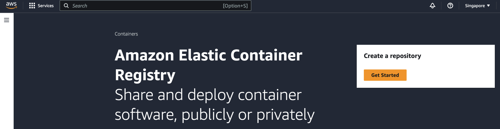
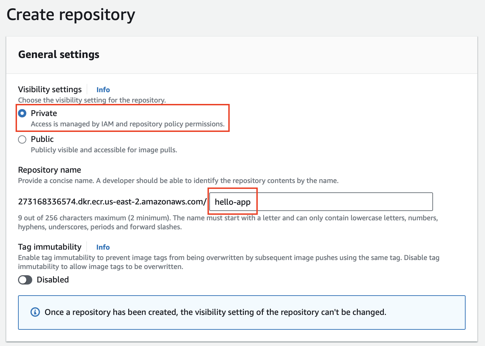
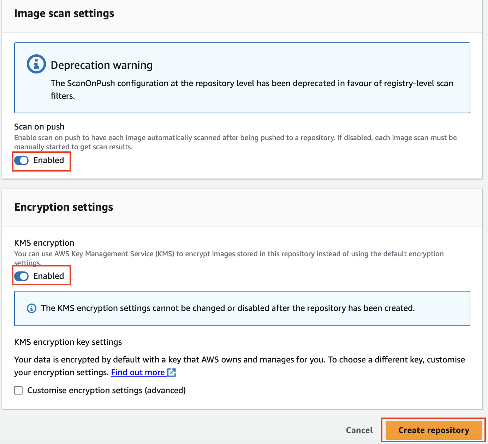
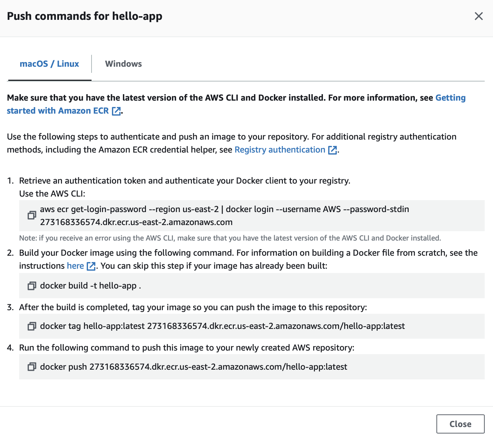

# Running Application on EKS

## 1. Create an ECR Repository

1.1 In the AWS Management Console, navigate to `Amazon ECR`.


1.2 Click on `Get Started` to create a repository.



1.3 Create an ECR repository `hello-app`. 



1.4 Under Image scan setting, enable Scan on push, and enable KMS encryption.



1.5 Once the repository is created, select the repository and click `View push commands`


You'd see the commands to authenticate, tag, and push your container immages to the ECR repository.



---

## 2. Clone application and build image

2.1 Clone sample application

```sh
git clone https://github.com/build-on-aws/instrumenting-java-apps-using-opentelemetry.git -b build-on-aws-tutorial
```

2.2 Create Dockerfile

```sh
cd instrumenting-java-apps-using-opentelemetry
touch Dockerfile
```

2.3 Update content in docker file

```sh
FROM maven:3.8.1-openjdk-17-slim

VOLUME /tmp
ADD . /usr/src/app
WORKDIR /usr/src/app

RUN mvn clean package -DskipTests

ENTRYPOINT [ "java", "-jar", "target/hello-app-1.0.jar" ]
```

2.4 Build to docker image

```sh
docker build -t hello-app:latest .
```

## 3. Tag and push your container image to the ECR repository

In your Cloud9 environment, follow the instructions from the push commands.

3.1 Authenticate your Docker client to your registry

```sh
aws ecr get-login-password --region ${AWS_REGION} | docker login --username AWS --password-stdin ${ACCOUNT_ID}.dkr.ecr.${AWS_REGION}.amazonaws.com
```
##### Result Output
```
WARNING! Your password will be stored unencrypted in /home/ec2-user/.docker/config.json.
Configure a credential helper to remove this warning. See
https://docs.docker.com/engine/reference/commandline/login/#credentials-store

Login Succeeded
```

3.2 Tag your `hello-app` image built in the previous section

```sh
docker tag hello-app:latest ${ACCOUNT_ID}.dkr.ecr.${AWS_REGION}.amazonaws.com/hello-app:latest
```

3.3 Push the image to ECR
```sh
docker push ${ACCOUNT_ID}.dkr.ecr.${AWS_REGION}.amazonaws.com/hello-app:latest
```

## 4. Deploy application

4.1 Create `hello-app` namespace

```sh
kubectl apply -f ~/environment/workshop/1-eks-app/namespace.yaml 
```

4.2 Create `hello-app` pod and service

```sh
kubectl apply -f ~/environment/workshop/1-eks-app/hello-app
```

4.3 Check that application is ready with the following command

```sh
kubectl get po -n hello-app
```
##### Result Output
```
NAME                         READY   STATUS    RESTARTS   AGE
hello-app-5887979795-8ldn7   1/1     Running   0          10s
```

4.4 Check `hello-app` log

```sh
export HELLO_APP_POD_NAME=$(kubectl get pods -n hello-app -o jsonpath='{.items[].metadata.name}')
kubectl logs -f ${HELLO_APP_POD_NAME} -n hello-app
```

4.5 Open `new Terminal`


4.6 Access to `hello-app` pod and invoke the API

```sh
export HELLO_APP_POD_NAME=$(kubectl get pods -n hello-app -o jsonpath='{.items[].metadata.name}')
kubectl exec -it ${HELLO_APP_POD_NAME}  -n hello-app -- sh
```

4.7 Invoke API inside Pod `sh`
```sh
curl -X GET http://localhost:8888/hello
```
##### Result Output
```
{"message":"Hello World"}
```

4.8 On `logging` tab, you will see output as below

```

  .   ____          _            __ _ _
 /\\ / ___'_ __ _ _(_)_ __  __ _ \ \ \ \
( ( )\___ | '_ | '_| | '_ \/ _` | \ \ \ \
 \\/  ___)| |_)| | | | | || (_| |  ) ) ) )
  '  |____| .__|_| |_|_| |_\__, | / / / /
 =========|_|==============|___/=/_/_/_/
 :: Spring Boot ::                (v3.1.2)

2023-10-15T08:09:49.606Z  INFO 1 --- [           main] tutorial.buildon.aws.o11y.HelloApp       : Starting HelloApp v1.0 using Java 17 with PID 1 (/usr/src/app/target/hello-app-1.0.jar started by root in /usr/src/app)
2023-10-15T08:09:49.613Z  INFO 1 --- [           main] tutorial.buildon.aws.o11y.HelloApp       : No active profile set, falling back to 1 default profile: "default"
2023-10-15T08:09:51.746Z  INFO 1 --- [           main] o.s.b.w.embedded.tomcat.TomcatWebServer  : Tomcat initialized with port(s): 8888 (http)
2023-10-15T08:09:51.763Z  INFO 1 --- [           main] o.apache.catalina.core.StandardService   : Starting service [Tomcat]
2023-10-15T08:09:51.765Z  INFO 1 --- [           main] o.apache.catalina.core.StandardEngine    : Starting Servlet engine: [Apache Tomcat/10.1.11]
2023-10-15T08:09:51.970Z  INFO 1 --- [           main] o.a.c.c.C.[Tomcat].[localhost].[/]       : Initializing Spring embedded WebApplicationContext
2023-10-15T08:09:51.971Z  INFO 1 --- [           main] w.s.c.ServletWebServerApplicationContext : Root WebApplicationContext: initialization completed in 2273 ms
2023-10-15T08:09:53.361Z  INFO 1 --- [           main] o.s.b.a.e.web.EndpointLinksResolver      : Exposing 1 endpoint(s) beneath base path '/actuator'
2023-10-15T08:09:53.514Z  INFO 1 --- [           main] o.s.b.w.embedded.tomcat.TomcatWebServer  : Tomcat started on port(s): 8888 (http) with context path ''
2023-10-15T08:09:53.549Z  INFO 1 --- [           main] tutorial.buildon.aws.o11y.HelloApp       : Started HelloApp in 5.048 seconds (process running for 6.197)
2023-10-15T08:14:24.933Z  INFO 1 --- [nio-8888-exec-2] o.a.c.c.C.[Tomcat].[localhost].[/]       : Initializing Spring DispatcherServlet 'dispatcherServlet'
2023-10-15T08:14:24.934Z  INFO 1 --- [nio-8888-exec-2] o.s.web.servlet.DispatcherServlet        : Initializing Servlet 'dispatcherServlet'
2023-10-15T08:14:24.936Z  INFO 1 --- [nio-8888-exec-2] o.s.web.servlet.DispatcherServlet        : Completed initialization in 2 ms
2023-10-15T08:14:25.010Z  INFO 1 --- [nio-8888-exec-2] t.buildon.aws.o11y.HelloAppController    : The response is valid.
```

Congratulations!! You have completed this section. Please continue on [Using OpenTelemetry Agent for Automatic instrument](2-eks-app-otel-agent.md)

---

## References
- [Containers Zero to One Workshop](https://catalog.us-east-1.prod.workshops.aws/workshops/613d57e0-6ae0-4fdc-bdb8-dac3930c2ec9/en-US)
---