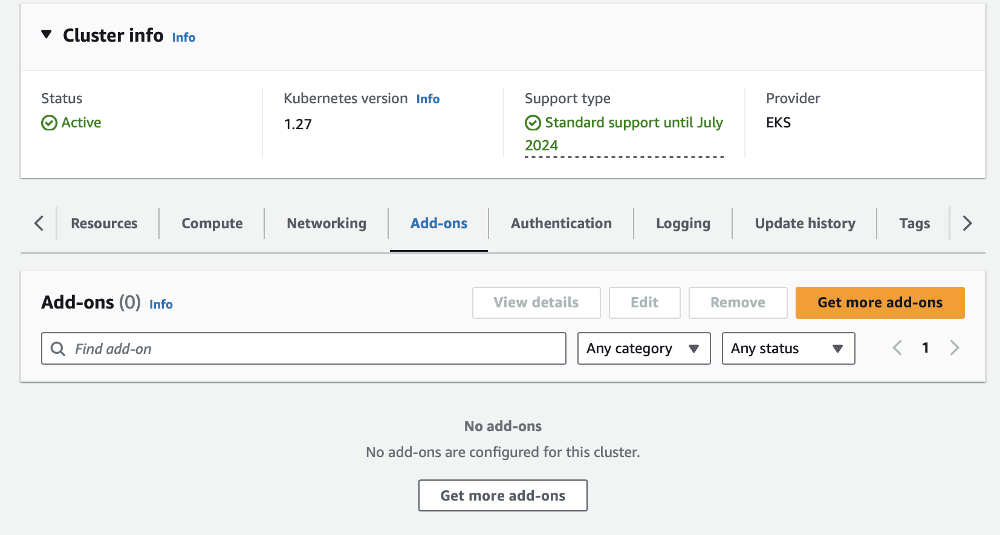

# AWS Distro for OpenTelemetry using EKS Add-Ons Installation

Welcome to the getting started guide for AWS Distro for OpenTelemetry (ADOT) using Elastic Kubernetes Service (EKS) add-ons. This guide shows you how to leverage Amazon EKS add-ons to install and manage ADOT within your Amazon EKS cluster.


The ADOT Operator detects the presence of or changes for the `OpenTelemetryCollector` resource. For any such change, the ADOT Operator performs the following actions:

Verifies that all the required connections for these creation, update, or deletion requests to the Kubernetes API server are available.
Deploys ADOT Collector instances in the way the user expressed in the `OpenTelemetryCollector` resource configuration.
The diagram below shows how the Collector CR request flows from the customer to the ADOT Operator to deploy the ADOT Collector.


---

## 1. Check EKS ADOT add-ons

1.1 You can see ADOT add-on available versions.
```
aws eks describe-addon-versions --kubernetes-version 1.27 --addon-name adot \
    --query 'addons[].addonVersions[].{Version: addonVersion, Defaultversion: compatibilities[0].defaultVersion}' --output table
```
##### Result Output
```
------------------------------------------
|          DescribeAddonVersions         |
+-----------------+----------------------+
| Defaultversion  |       Version        |
+-----------------+----------------------+
|  True           |  v0.82.0-eksbuild.1  |
|  False          |  v0.80.0-eksbuild.2  |
|  False          |  v0.80.0-eksbuild.1  |
|  False          |  v0.78.0-eksbuild.2  |
|  False          |  v0.78.0-eksbuild.1  |
|  False          |  v0.76.1-eksbuild.1  |
|  False          |  v0.74.0-eksbuild.1  |
+-----------------+----------------------+
```

1.2 Determine the current add-ons installed on your cluster

```sh
EKS_CLUSTER_NAME=PetSite
eksctl get addon --cluster $EKS_CLUSTER_NAME
```
##### Result Output
```
2023-10-14 08:28:51 [ℹ]  Kubernetes version "1.27" in use by cluster "PetSite"
2023-10-14 08:28:51 [ℹ]  getting all addons
No addons found
```

1.3 You also can check via AWS Console



---

## 2. ADOT Operator

The ADOT Operator uses admission webhooks to mutate and validate the Collector Custom Resource (CR) requests. The [cert-manager](https://cert-manager.io/docs/) will generate a self-signed certificate.

2.1 Install cert-manager with the command:

```sh
kubectl apply -f https://github.com/cert-manager/cert-manager/releases/download/v1.8.2/cert-manager.yaml
```
##### Result Output
```
namespace/cert-manager created
customresourcedefinition.apiextensions.k8s.io/certificaterequests.cert-manager.io created
customresourcedefinition.apiextensions.k8s.io/certificates.cert-manager.io created
.
.
.
mutatingwebhookconfiguration.admissionregistration.k8s.io/cert-manager-webhook created
validatingwebhookconfiguration.admissionregistration.k8s.io/cert-manager-webhook created
```

2.2 Check that cert-manager is ready with the following command:

```sh
kubectl get pod -n cert-manager
```
##### Result Output
```
NAME                                       READY   STATUS    RESTARTS   AGE
cert-manager-7cd8798b85-brssl              1/1     Running   0          5m57s
cert-manager-cainjector-8699cf859b-4slck   1/1     Running   0          5m57s
cert-manager-webhook-85f6989b69-gxfdf      1/1     Running   0          5m57s
```

2.3 Apply the necessary permissions for ADOT to your cluster with the command:

```sh
kubectl apply -f https://amazon-eks.s3.amazonaws.com/docs/addons-otel-permissions.yaml
```
##### Result Output
```
namespace/opentelemetry-operator-system created
clusterrole.rbac.authorization.k8s.io/eks:addon-manager-otel created
clusterrolebinding.rbac.authorization.k8s.io/eks:addon-manager-otel created
role.rbac.authorization.k8s.io/eks:addon-manager created
rolebinding.rbac.authorization.k8s.io/eks:addon-manager created
```

2.4 Install the ADOT Operator into your Amazon EKS cluster using the command:

```
aws eks create-addon --addon-name adot --cluster-name $EKS_CLUSTER_NAME
```
##### Result Output
```
{
    "addon": {
        "addonName": "adot",
        "clusterName": "PetSite",
        "status": "CREATING",
        "addonVersion": "v0.82.0-eksbuild.1",
        "health": {
            "issues": []
        },
        "addonArn": "arn:aws:eks:us-east-2:273168336574:addon/PetSite/adot/68c5974a-5e58-17b7-bf67-020134a7e20e",
        "createdAt": "2023-10-14T14:26:21.681000+00:00",
        "modifiedAt": "2023-10-14T14:26:21.706000+00:00",
        "tags": {}
    }
}
```
The status field value will be CREATING until complete.

Verify that ADOT is installed and running with the command:

```sh
aws eks describe-addon --addon-name adot --cluster-name $EKS_CLUSTER_NAME
```

##### Result Output
```
{
    "addon": {
        "addonName": "adot",
        "clusterName": "PetSite",
        "status": "ACTIVE",
        "addonVersion": "v0.82.0-eksbuild.1",
        "health": {
            "issues": []
        },
        "addonArn": "arn:aws:eks:us-east-2:273168336574:addon/PetSite/adot/68c5974a-5e58-17b7-bf67-020134a7e20e",
        "createdAt": "2023-10-14T14:26:21.681000+00:00",
        "modifiedAt": "2023-10-14T14:26:41.186000+00:00",
        "tags": {}
    }
}
```

You'll see "status": "ACTIVE" when creation is complete.

2.5 You also can check via AWS Console


---

## 3. ADOT Collector

Once the ADOT EKS Add-On is running, you can deploy the ADOT Collector into your EKS cluster. The ADOT Collector can be deployed in one of four modes: Deployment, Daemonset, StatefulSet, and Sidecar. Each mode is briefly described below.

3.1 Use your IAM role to launch the ADOT Collector
You can associate your IAM role to your EKS service account using IRSA. Your service account can then provide AWS permissions to the containers you run in any pod that use that service account.

```sh
eksctl create iamserviceaccount \
    --name adot-collector \
    --namespace otel \
    --cluster $EKS_CLUSTER_NAME \
    --attach-policy-arn arn:aws:iam::aws:policy/AmazonPrometheusRemoteWriteAccess \
    --attach-policy-arn arn:aws:iam::aws:policy/AWSXrayWriteOnlyAccess \
    --attach-policy-arn arn:aws:iam::aws:policy/CloudWatchAgentServerPolicy \
    --approve \
    --override-existing-serviceaccounts
```

**Note:**
you only need to attach the policies for that service:
arn:aws:iam::aws:policy/AmazonPrometheusRemoteWriteAccess grants write access to the Prometheus service.
arn:aws:iam::aws:policy/AWSXrayWriteOnlyAccess grants write access to the AWS X-Ray service.
arn:aws:iam::aws:policy/CloudWatchAgentServerPolicy grants access to write the CloudWatch service.

3.2 Deploy the ADOT Collector

```sh
cd ~/environment
sed -i -e s/\<AWS_REGION\>/${AWS_REGION}/g ~/environment/adot-eks/workshop/3-eks-adot-add-on/otel-collector-config.yaml
kubectl apply -f ~/environment/adot-eks/workshop/3-eks-adot-add-on/otel-collector-config.yaml
```
##### Result Output
```sh
opentelemetrycollector.opentelemetry.io/my-adot-collector created
```

3.3 Opentelemetry Configuration Details


```yaml
apiVersion: opentelemetry.io/v1alpha1
kind: OpenTelemetryCollector # Custom Resource Definition
metadata:
  name: adot
  namespace: otel
spec:
  image: public.ecr.aws/aws-observability/aws-otel-collector:latest
  mode: deployment # daemonset, statefulset, sidecar
  serviceAccount: adot-collector # Service account for use with Collector
  config: |
    receivers:
      otlp:
        protocols:
          grpc:
            endpoint: 0.0.0.0:4317
    processors:

    exporters:
      awsxray:
        region: <YOUR_AWS_REGION>

    service:
      pipelines:
        traces:
          receivers: [otlp]
          processors: []
          exporters: [awsxray]
```

**Note** This collector we will be using on next section. to send trace data to AWS X-Ray

3.4 Describe Opentelemetry Collector Pod

```sh
export OTEL_COLLECTOR_POD_NAME=$(kubectl get pods -n otel -o jsonpath='{.items[].metadata.name}')
kubectl describe pod $OTEL_COLLECTOR_POD_NAME -n otel
```
##### Result Output
```
Name:             adot-collector-8476b755c6-6tmb8
Namespace:        otel
Priority:         0
Service Account:  adot-collector
Node:             ip-11-0-162-21.us-east-2.compute.internal/11.0.162.21
Start Time:       Mon, 16 Oct 2023 10:05:17 +0000
Labels:           app.kubernetes.io/component=opentelemetry-collector
                  app.kubernetes.io/instance=otel.adot
                  app.kubernetes.io/managed-by=opentelemetry-operator
                  app.kubernetes.io/name=adot-collector
                  app.kubernetes.io/part-of=opentelemetry
                  app.kubernetes.io/version=latest
                  pod-template-hash=8476b755c6
Annotations:      opentelemetry-operator-config/sha256: 5e555c3c76953e1447915d90847979032e32a0cf29e65ec945fd6e710690aeeb
                  prometheus.io/path: /metrics
                  prometheus.io/port: 8888
                  prometheus.io/scrape: true
Status:           Running
IP:               11.0.188.142
IPs:
  IP:           11.0.188.142
Controlled By:  ReplicaSet/adot-collector-8476b755c6
Containers:
  otc-container:
    Container ID:  containerd://ced7001245f08603a7114118bcb9e1cef6b009b49749f453d99b25a26dba9a5a
    Image:         public.ecr.aws/aws-observability/aws-otel-collector:latest
    Image ID:      docker.io/amazon/aws-otel-collector@sha256:598b4a2c32ab3b528ebaf9926c4845168ca4d0f2a28940cbd37c21da90954aae
    Ports:         8888/TCP, 4317/TCP
    Host Ports:    0/TCP, 0/TCP
    Args:
      --config=/conf/collector.yaml
    State:          Running
      Started:      Mon, 16 Oct 2023 10:05:18 +0000
    Ready:          True
    Restart Count:  0
    Environment:
      POD_NAME:                     adot-collector-8476b755c6-6tmb8 (v1:metadata.name)
      AWS_STS_REGIONAL_ENDPOINTS:   regional
      AWS_DEFAULT_REGION:           us-east-2
      AWS_REGION:                   us-east-2
      AWS_ROLE_ARN:                 arn:aws:iam::538334289408:role/eksctl-PetSite-addon-iamserviceaccount-otel-a-Role1-V6mVin6kQ5V5
      AWS_WEB_IDENTITY_TOKEN_FILE:  /var/run/secrets/eks.amazonaws.com/serviceaccount/token
    Mounts:
      /conf from otc-internal (rw)
      /var/run/secrets/eks.amazonaws.com/serviceaccount from aws-iam-token (ro)
      /var/run/secrets/kubernetes.io/serviceaccount from kube-api-access-69t9c (ro)
Conditions:
  Type              Status
  Initialized       True 
  Ready             True 
  ContainersReady   True 
  PodScheduled      True 
Volumes:
  aws-iam-token:
    Type:                    Projected (a volume that contains injected data from multiple sources)
    TokenExpirationSeconds:  86400
  otc-internal:
    Type:      ConfigMap (a volume populated by a ConfigMap)
    Name:      adot-collector
    Optional:  false
  kube-api-access-69t9c:
    Type:                    Projected (a volume that contains injected data from multiple sources)
    TokenExpirationSeconds:  3607
    ConfigMapName:           kube-root-ca.crt
    ConfigMapOptional:       <nil>
    DownwardAPI:             true
QoS Class:                   BestEffort
Node-Selectors:              <none>
Tolerations:                 node.kubernetes.io/not-ready:NoExecute op=Exists for 300s
                             node.kubernetes.io/unreachable:NoExecute op=Exists for 300s
Events:
  Type    Reason     Age   From               Message
  ----    ------     ----  ----               -------
  Normal  Scheduled  31s   default-scheduler  Successfully assigned otel/adot-collector-8476b755c6-6tmb8 to ip-11-0-162-21.us-east-2.compute.internal
  Normal  Pulling    30s   kubelet            Pulling image "public.ecr.aws/aws-observability/aws-otel-collector:latest"
  Normal  Pulled     30s   kubelet            Successfully pulled image "public.ecr.aws/aws-observability/aws-otel-collector:latest" in 163.78129ms (163.804833ms including waiting)
  Normal  Created    30s   kubelet            Created container otc-container
  Normal  Started    30s   kubelet            Started container otc-container
```

3.4 Check Opentelemetry Collector Pod Log

```sh
export OTEL_COLLECTOR_POD_NAME=$(kubectl get pods -n otel -o jsonpath='{.items[].metadata.name}')
kubectl logs -f $OTEL_COLLECTOR_POD_NAME -n otel
```
##### Result Output
```
2023/10/16 10:05:18 ADOT Collector version: v0.33.3
2023/10/16 10:05:18 found no extra config, skip it, err: open /opt/aws/aws-otel-collector/etc/extracfg.txt: no such file or directory
2023/10/16 10:05:18 attn: users of the statsd receiver please refer to https://github.com/aws-observability/aws-otel-collector/issues/2249 in regards to an ADOT Collector v0.33.0 breaking change
2023/10/16 10:05:18 attn: users of the awscontainerinsightreceiver please refer to https://github.com/aws-observability/aws-otel-collector/issues/2317 in regards to an ADOT Collector v0.35.0 breaking change
2023-10-16T10:05:18.569Z        info    service/telemetry.go:84 Setting up own telemetry...
2023-10-16T10:05:18.569Z        info    service/telemetry.go:201        Serving Prometheus metrics      {"address": ":8888", "level": "Basic"}
2023-10-16T10:05:18.571Z        info    service/service.go:138  Starting aws-otel-collector...  {"Version": "v0.33.3", "NumCPU": 2}
2023-10-16T10:05:18.571Z        info    extensions/extensions.go:31     Starting extensions...
2023-10-16T10:05:18.571Z        warn    internal@v0.84.0/warning.go:40  Using the 0.0.0.0 address exposes this server to every network interface, which may facilitate Denial of Service attacks       {"kind": "receiver", "name": "otlp", "data_type": "traces", "documentation": "https://github.com/open-telemetry/opentelemetry-collector/blob/main/docs/security-best-practices.md#safeguards-against-denial-of-service-attacks"}
2023-10-16T10:05:18.571Z        info    otlpreceiver@v0.84.0/otlp.go:83 Starting GRPC server    {"kind": "receiver", "name": "otlp", "data_type": "traces", "endpoint": "0.0.0.0:4317"}
2023-10-16T10:05:18.571Z        info    service/service.go:161  Everything is ready. Begin running and processing data.
```

Now, OpenTelemetry Collector is running. Please leave this tap open and open new tab on next section.

Congratulations!! You have completed this section. Please continue on [Automatic Instrumentation (Traces to AWS X-Ray)](4-auto-trace-x-ray.md)

---

## References
- [Managing Amazon EKS add-ons](https://docs.aws.amazon.com/eks/latest/userguide/managing-add-ons.html)
- [Getting Started with AWS Distro for OpenTelemetry using EKS Add-Ons](https://aws-otel.github.io/docs/getting-started/adot-eks-add-on)
- [Collector Configuration for AWS X-Ray](https://aws-otel.github.io/docs/getting-started/adot-eks-add-on/config-xray)
- [OpenTelemetry Collector](https://opentelemetry.io/docs/collector/)
---