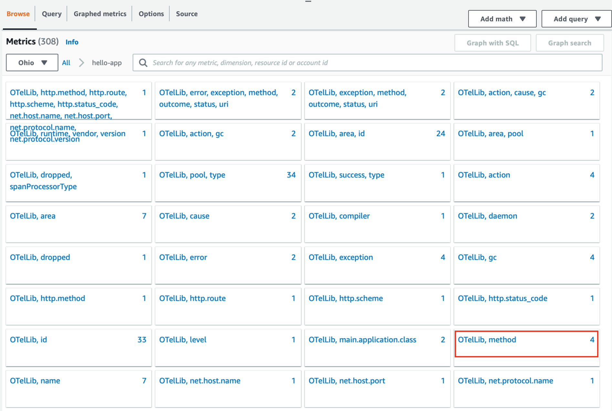
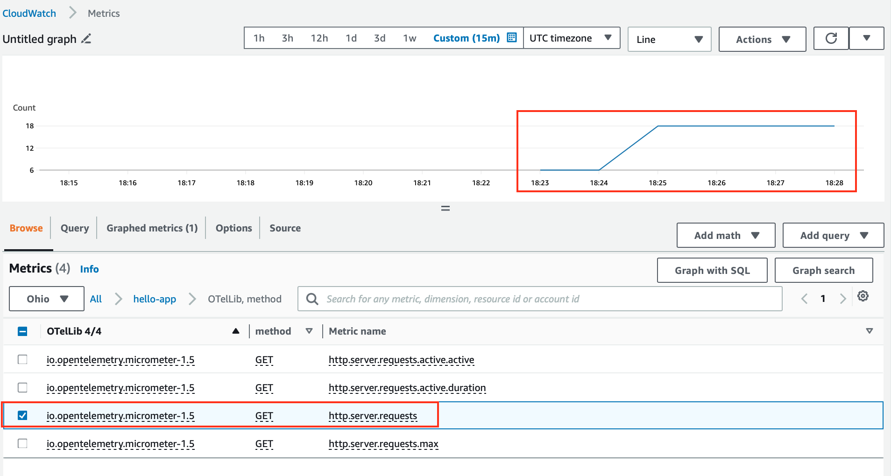

# Automatic Instrumentation (Metrics to CloudWatch Metrics)

## 1. ADOT Collector

1.1 Deploy the ADOT Collector

```sh
cd ~/environment
sed -i -e s/\<AWS_REGION\>/${AWS_REGION}/g ~/environment/adot-eks/workshop/5-auto-metrics-cloudwatch/otel-collector-config.yaml
kubectl apply -f ~/environment/adot-eks/workshop/5-auto-metrics-cloudwatch/otel-collector-config.yaml
```
##### Result Output
```sh
opentelemetrycollector.opentelemetry.io/my-adot-collector configured
```

1.2 Opentelemetry Configuration Details

```yaml
apiVersion: opentelemetry.io/v1alpha1
kind: OpenTelemetryCollector
metadata:
  name: adot
  namespace: otel
spec:
  image: public.ecr.aws/aws-observability/aws-otel-collector:latest
  mode: deployment 
  serviceAccount: adot-collector 
  config: |
    receivers:
      otlp:
        protocols:
          grpc:
            endpoint: 0.0.0.0:4317
    processors:
      batch:
        timeout: 5s
        send_batch_size: 1024

    exporters:
      awsemf:
        region: '<AWS_REGION>'
        log_group_name: '/metrics/otel'
        log_stream_name: 'otel-using-java'
      awsxray:
        region: <AWS_REGION>

    service:
      pipelines:
        metrics:
          receivers: [otlp]
          processors: [batch]
          exporters: [awsemf]
        traces:
          receivers: [otlp]
          processors: [batch]
          exporters: [awsxray]
```

1.3 Check Opentelemetry Collector Pod Log

```sh
export OTEL_COLLECTOR_POD_NAME=$(kubectl get pods -n otel -o jsonpath='{.items[].metadata.name}')
kubectl logs -f $OTEL_COLLECTOR_POD_NAME -n otel
```
##### Result Output
```
2023/10/15 18:09:29 ADOT Collector version: v0.33.3
2023/10/15 18:09:29 found no extra config, skip it, err: open /opt/aws/aws-otel-collector/etc/extracfg.txt: no such file or directory
2023/10/15 18:09:29 attn: users of the statsd receiver please refer to https://github.com/aws-observability/aws-otel-collector/issues/2249 in regards to an ADOT Collector v0.33.0 breaking change
2023/10/15 18:09:29 attn: users of the awscontainerinsightreceiver please refer to https://github.com/aws-observability/aws-otel-collector/issues/2317 in regards to an ADOT Collector v0.35.0 breaking change
2023-10-15T18:09:29.470Z        info    service/telemetry.go:84 Setting up own telemetry...
2023-10-15T18:09:29.471Z        info    service/telemetry.go:201        Serving Prometheus metrics      {"address": ":8888", "level": "Basic"}
2023-10-15T18:09:29.471Z        warn    awsemfexporter@v0.84.0/emf_exporter.go:74       the default value for DimensionRollupOption will be changing to NoDimensionRollupin a future release. See https://github.com/open-telemetry/opentelemetry-collector-contrib/issues/23997 for moreinformation    {"kind": "exporter", "data_type": "metrics", "name": "awsemf"}
2023-10-15T18:09:29.472Z        info    service/service.go:138  Starting aws-otel-collector...  {"Version": "v0.33.3", "NumCPU": 2}
2023-10-15T18:09:29.472Z        info    extensions/extensions.go:31     Starting extensions...
2023-10-15T18:09:29.472Z        warn    internal@v0.84.0/warning.go:40  Using the 0.0.0.0 address exposes this server to every network interface, which may facilitate Denial of Service attacks        {"kind": "receiver", "name": "otlp", "data_type": "metrics", "documentation": "https://github.com/open-telemetry/opentelemetry-collector/blob/main/docs/security-best-practices.md#safeguards-against-denial-of-service-attacks"}
2023-10-15T18:09:29.472Z        info    otlpreceiver@v0.84.0/otlp.go:83 Starting GRPC server    {"kind": "receiver", "name": "otlp", "data_type": "metrics", "endpoint": "0.0.0.0:4317"}
2023-10-15T18:09:29.472Z        info    service/service.go:161  Everything is ready. Begin running and processing data.
```

Now, OpenTelemetry Collector is running. Please leave this tap open and open new tab to continue on next topic.

---

## 2. Deploy application

2.1 Update `hello-app` deployment

```sh
sed -i -e s/\<AWS_REGION\>/${AWS_REGION}/g -e s/\<ACCOUNT_ID\>/${ACCOUNT_ID}/g ~/environment/adot-eks/workshop/5-auto-metrics-cloudwatch/hello-app/deployment.yaml
kubectl apply -f ~/environment/adot-eks/workshop/5-auto-metrics-cloudwatch/hello-app
```
##### Result Output
```
deployment.apps/hello-app configured
```

Deployment yaml file

```yaml
apiVersion: apps/v1
kind: Deployment
metadata:
  name: hello-app
  namespace: hello-app
  labels:
    app.kubernetes.io/created-by: eks-workshop
    app.kubernetes.io/type: app
spec:
  replicas: 1
  selector:
    matchLabels:
      app.kubernetes.io/name: hello-app
      app.kubernetes.io/instance: hello-app
      app.kubernetes.io/component: service
  template:
    metadata:
      labels:
        app.kubernetes.io/name: hello-app
        app.kubernetes.io/instance: hello-app
        app.kubernetes.io/component: service
        app.kubernetes.io/created-by: eks-workshop
    spec:
      serviceAccountName: hello-app
      containers:
        - name: hello-app
          env:
            - name: OTEL_TRACES_EXPORTER
              value: otlp
            - name: OTEL_METRICS_EXPORTER
              value: otlp
            - name: OTEL_EXPORTER_OTLP_ENDPOINT
              value: http://adot-collector.otel:4317
          image: "273168336574.dkr.ecr.us-east-2.amazonaws.com/hello-app:latest"
          imagePullPolicy: Always
          ports:
            - name: http
              containerPort: 8080
              protocol: TCP
          resources:
            limits:
              memory: 1Gi
            requests:
              cpu: 250m
              memory: 1Gi
```

1.2 Check that application is ready with the following command

```sh
kubectl get po -n hello-app
```
##### Result Output
```
NAME                         READY   STATUS    RESTARTS   AGE
hello-app-cc7b5b55c-lg9f9   1/1     Running   0          10s
```

1.3 Check `hello-app` log

```sh
export HELLO_APP_POD_NAME=$(kubectl get pods -n hello-app -o jsonpath='{.items[].metadata.name}')
kubectl logs -f ${HELLO_APP_POD_NAME} -n hello-app
```
##### Result Output
```
OpenJDK 64-Bit Server VM warning: Sharing is only supported for boot loader classes because bootstrap classpath has been appended
[otel.javaagent 2023-10-15 18:20:29:567 +0000] [main] INFO io.opentelemetry.javaagent.tooling.VersionLogger - opentelemetry-javaagent - version: 1.30.0-aws
[otel.javaagent 2023-10-15 18:20:30:156 +0000] [main] INFO io.opentelemetry.sdk.resources.Resource - Attempting to merge Resources with different schemaUrls. The resulting Resource will have no schemaUrl assigned. Schema 1: https://opentelemetry.io/schemas/1.21.0 Schema 2: https://opentelemetry.io/schemas/1.20.0

  .   ____          _            __ _ _
 /\\ / ___'_ __ _ _(_)_ __  __ _ \ \ \ \
( ( )\___ | '_ | '_| | '_ \/ _` | \ \ \ \
 \\/  ___)| |_)| | | | | || (_| |  ) ) ) )
  '  |____| .__|_| |_|_| |_\__, | / / / /
 =========|_|==============|___/=/_/_/_/
 :: Spring Boot ::                (v3.1.2)

2023-10-15T18:20:35.911Z  INFO 1 --- [           main] tutorial.buildon.aws.o11y.HelloApp       : Starting HelloApp v1.0 using Java 17 with PID 1 (/usr/src/app/target/hello-app-1.0.jar started by root in /usr/src/app)
2023-10-15T18:20:35.921Z  INFO 1 --- [           main] tutorial.buildon.aws.o11y.HelloApp       : No active profile set, falling back to 1 default profile: "default"
2023-10-15T18:20:38.751Z  INFO 1 --- [           main] o.s.b.w.embedded.tomcat.TomcatWebServer  : Tomcat initialized with port(s): 8888 (http)
2023-10-15T18:20:38.808Z  INFO 1 --- [           main] o.apache.catalina.core.StandardService   : Starting service [Tomcat]
2023-10-15T18:20:38.809Z  INFO 1 --- [           main] o.apache.catalina.core.StandardEngine    : Starting Servlet engine: [Apache Tomcat/10.1.11]
2023-10-15T18:20:38.925Z  INFO 1 --- [           main] o.a.c.c.C.[Tomcat].[localhost].[/]       : Initializing Spring embedded WebApplicationContext
2023-10-15T18:20:38.926Z  INFO 1 --- [           main] w.s.c.ServletWebServerApplicationContext : Root WebApplicationContext: initialization completed in 2824 ms
2023-10-15T18:20:40.371Z  INFO 1 --- [           main] o.s.b.a.e.web.EndpointLinksResolver      : Exposing 1 endpoint(s) beneath base path '/actuator'
2023-10-15T18:20:40.588Z  INFO 1 --- [           main] o.s.b.w.embedded.tomcat.TomcatWebServer  : Tomcat started on port(s): 8888 (http) with context path ''
2023-10-15T18:20:40.636Z  INFO 1 --- [           main] tutorial.buildon.aws.o11y.HelloApp       : Started HelloApp in 5.596 seconds (process running for 11.386)
```

1.4 Open `new Terminal`


1.5 Access to `hello-app` pod and invoke the API

```sh
export HELLO_APP_POD_NAME=$(kubectl get pods -n hello-app -o jsonpath='{.items[].metadata.name}')
kubectl exec -it ${HELLO_APP_POD_NAME}  -n hello-app -- sh
```

1.6 Invoke API inside Pod `sh`

You can invoke API as much as you want (5-10 invocations)

```sh
curl -X GET http://localhost:8888/hello
```
##### Result Output
```
{"message":"Hello World"}
```

---

## 2. CloudWatch Metrics

2.1 Open Cloudwatch [Metrics -> All metrics](https://console.aws.amazon.com/cloudwatch/home)

In `Browse` tab, you will see `hello-app` shows in the `Custom namespaces`. Select on `hello-app`


2.2 Select metrics: `OTelLib, method` 



2.3 You will list of `Metrics`

Select metrics name: `http.server.requests`, You will see




2.4 You will see `Segment Timelines` detail as belows


Congratulations!! You have completed this section. Please continue on [Environment Variable](6-environment-variable.md)

---

## References
- [Using CloudWatch Metrics with AWS Distro for OpenTelemetry](https://aws-otel.github.io/docs/getting-started/cloudwatch-metrics)
---