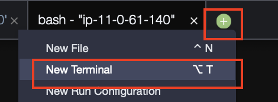
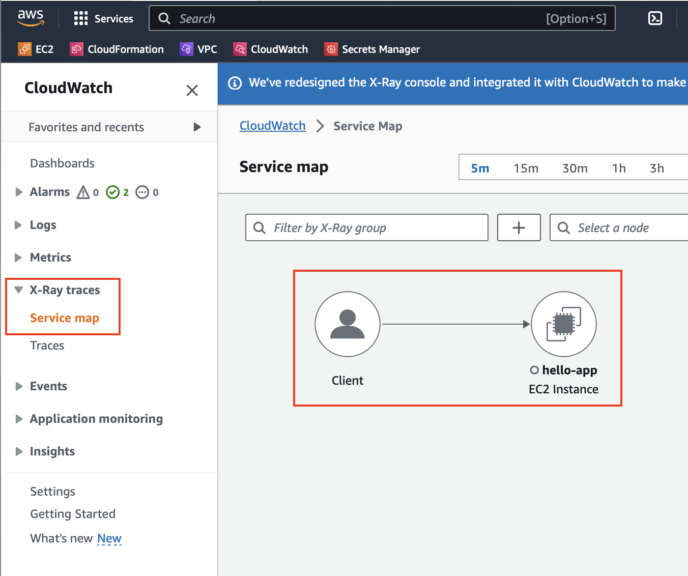
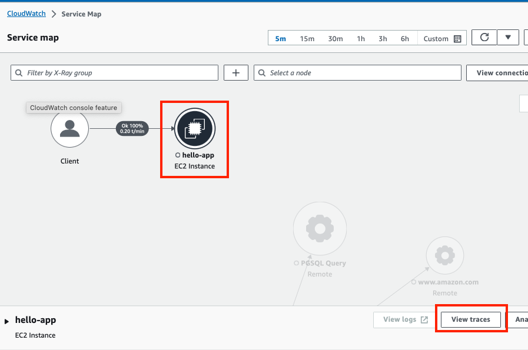
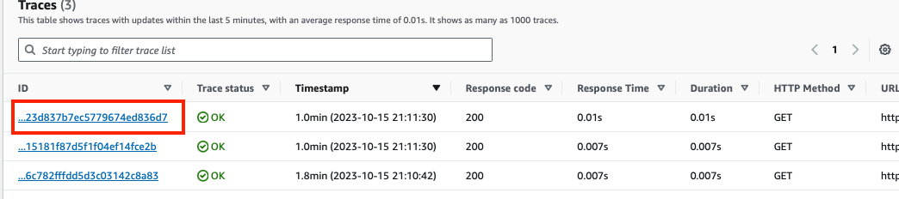
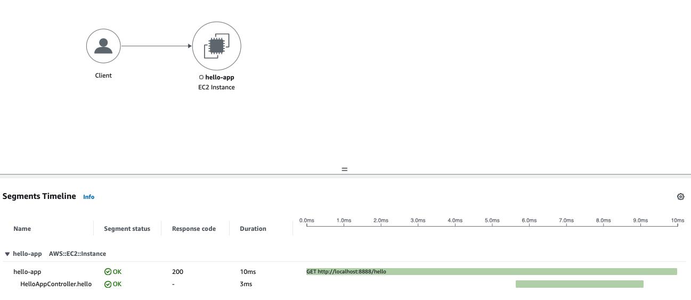
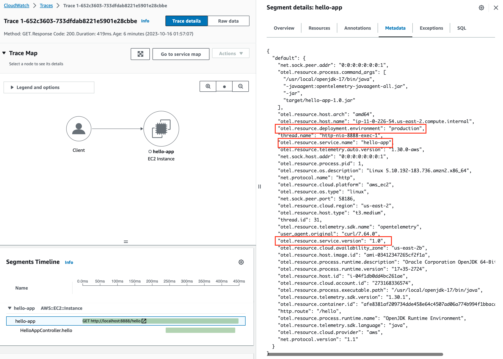

# Environment Variable

## 1. Deploy application

1.1 Create `hello-app` pod and service

```sh
kubectl apply -f ~/environment/workshop/6-environment-variable/hello-app
```
##### Result Output
```
deployment.apps/hello-app configured
service/hello-app unchanged
serviceaccount/hello-app unchanged
```

1.2 Check that application is ready with the following command

```sh
kubectl get po -n hello-app
```
##### Result Output
```
NAME                         READY   STATUS    RESTARTS   AGE
hello-app-cc7b5b55c-lg9f9   1/1     Running   0          10s
```

1.3 Check `hello-app` log

```sh
export HELLO_APP_POD_NAME=$(kubectl get pods -n hello-app -o jsonpath='{.items[].metadata.name}')
kubectl logs -f ${HELLO_APP_POD_NAME} -n hello-app
```
##### Result Output
```
OpenJDK 64-Bit Server VM warning: Sharing is only supported for boot loader classes because bootstrap classpath has been appended
[otel.javaagent 2023-10-15 18:56:12:730 +0000] [main] INFO io.opentelemetry.javaagent.tooling.VersionLogger - opentelemetry-javaagent - version: 1.30.0-aws
[otel.javaagent 2023-10-15 18:56:13:518 +0000] [main] INFO io.opentelemetry.sdk.resources.Resource - Attempting to merge Resources with different schemaUrls. The resulting Resource will have no schemaUrl assigned. Schema 1: https://opentelemetry.io/schemas/1.21.0 Schema 2: https://opentelemetry.io/schemas/1.20.0

  .   ____          _            __ _ _
 /\\ / ___'_ __ _ _(_)_ __  __ _ \ \ \ \
( ( )\___ | '_ | '_| | '_ \/ _` | \ \ \ \
 \\/  ___)| |_)| | | | | || (_| |  ) ) ) )
  '  |____| .__|_| |_|_| |_\__, | / / / /
 =========|_|==============|___/=/_/_/_/
 :: Spring Boot ::                (v3.1.2)

2023-10-15T18:56:18.917Z  INFO 1 --- [           main] tutorial.buildon.aws.o11y.HelloApp       : Starting HelloApp v1.0 using Java 17 with PID 1 (/usr/src/app/target/hello-app-1.0.jar started by root in /usr/src/app)
2023-10-15T18:56:18.941Z  INFO 1 --- [           main] tutorial.buildon.aws.o11y.HelloApp       : No active profile set, falling back to 1 default profile: "default"
2023-10-15T18:56:21.617Z  INFO 1 --- [           main] o.s.b.w.embedded.tomcat.TomcatWebServer  : Tomcat initialized with port(s): 8888 (http)
2023-10-15T18:56:21.675Z  INFO 1 --- [           main] o.apache.catalina.core.StandardService   : Starting service [Tomcat]
2023-10-15T18:56:21.676Z  INFO 1 --- [           main] o.apache.catalina.core.StandardEngine    : Starting Servlet engine: [Apache Tomcat/10.1.11]
2023-10-15T18:56:21.800Z  INFO 1 --- [           main] o.a.c.c.C.[Tomcat].[localhost].[/]       : Initializing Spring embedded WebApplicationContext
2023-10-15T18:56:21.801Z  INFO 1 --- [           main] w.s.c.ServletWebServerApplicationContext : Root WebApplicationContext: initialization completed in 2657 ms
2023-10-15T18:56:23.330Z  INFO 1 --- [           main] o.s.b.a.e.web.EndpointLinksResolver      : Exposing 1 endpoint(s) beneath base path '/actuator'
2023-10-15T18:56:23.572Z  INFO 1 --- [           main] o.s.b.w.embedded.tomcat.TomcatWebServer  : Tomcat started on port(s): 8888 (http) with context path ''
2023-10-15T18:56:23.602Z  INFO 1 --- [           main] tutorial.buildon.aws.o11y.HelloApp       : Started HelloApp in 5.499 seconds (process running for 11.211)
2023-10-15T18:57:07.284Z  INFO 1 --- [nio-8888-exec-1] o.a.c.c.C.[Tomcat].[localhost].[/]       : Initializing Spring DispatcherServlet 'dispatcherServlet'
2023-10-15T18:57:07.286Z  INFO 1 --- [nio-8888-exec-1] o.s.web.servlet.DispatcherServlet        : Initializing Servlet 'dispatcherServlet'
2023-10-15T18:57:07.289Z  INFO 1 --- [nio-8888-exec-1] o.s.web.servlet.DispatcherServlet        : Completed initialization in 1 ms
2023-10-15T18:57:07.398Z  INFO 1 --- [nio-8888-exec-1] t.buildon.aws.o11y.HelloAppController    : The response is valid.
```

1.4 Open `new Terminal`



1.5 Access to `hello-app` pod and invoke the API

```sh
export HELLO_APP_POD_NAME=$(kubectl get pods -n hello-app -o jsonpath='{.items[].metadata.name}')
kubectl exec -it ${HELLO_APP_POD_NAME}  -n hello-app -- sh
```

1.6 Invoke API inside Pod `sh`
```sh
curl -X GET http://localhost:8888/hello
```
##### Result Output
```
{"message":"Hello World"}
```

---

## 2. CloudWatch X-Ray

2.1 Open Cloudwatch [X-Ray -> traces -> Service map](https://console.aws.amazon.com/cloudwatch/home)

You will see `client -> hello-app` shows in the `Service map`



2.2 Select `hello-app` and `View traces` 



2.3 You will list of `Traces` that your invoked via curl

Select trace record to view detail




2.4 You will see `Segment Timelines` detail as belows



2.5 On `Metadata` tab, you will see attributes that you defined on `OTEL_RESOURCE_ATTRIBUTES`



Congratulations!! You have completed this section. Please continue on [Manual Instrumentation (Traces to AWS X-Ray)](7-manual-trace-x-ray.md)

---

## References
- [Environment Variable Specification](https://opentelemetry.io/docs/specs/otel/configuration/sdk-environment-variables/)
---