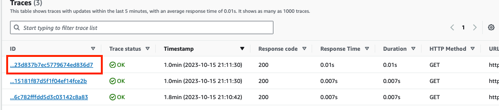

# Manual Instrumentation (Traces to AWS X-Ray)

## 1. Update application code

1.1 Access to `instrumenting-java-apps-using-opentelemetry` project folder. 

```sh
cd instrumenting-java-apps-using-opentelemetry
```

1.2 Open `pom.xml` file. 

Update `properties` by adding `otel`

```xml
        <otel.traces.api.version>0.13.1</otel.traces.api.version>
        <otel.metrics.api.version>1.10.0-alpha-rc.1</otel.metrics.api.version>
```
##### Completed `properties`
```xml
    <properties>
        <maven.compiler.release>17</maven.compiler.release>
        <otel.traces.api.version>0.13.1</otel.traces.api.version>
        <otel.metrics.api.version>1.10.0-alpha-rc.1</otel.metrics.api.version>
    </properties>
```

Update `dependency`

```xml
    <dependency>
        <groupId>javax.annotation</groupId>
        <artifactId>javax.annotation-api</artifactId>
        <version>1.3.2</version>
    </dependency>

    <dependency>
        <groupId>io.opentelemetry</groupId>
        <artifactId>opentelemetry-api</artifactId>
        <version>1.28.0</version>
    </dependency>

    <dependency>
        <groupId>io.opentelemetry.instrumentation</groupId>
        <artifactId>opentelemetry-instrumentation-annotations</artifactId>
        <version>1.28.0</version>
    </dependency>

    <dependency>
        <groupId>io.opentelemetry</groupId>
        <artifactId>opentelemetry-api-trace</artifactId>
        <version>${otel.traces.api.version}</version>
    </dependency>

    <dependency>
        <groupId>io.opentelemetry</groupId>
        <artifactId>opentelemetry-api-metrics</artifactId>
        <version>${otel.metrics.api.version}</version>
    </dependency>    
```

1.3 Go to `src/main/java` folder. Update Java class `HelloAppController.java`

```java
package tutorial.buildon.aws.o11y;

import java.util.Objects;

import org.slf4j.Logger;
import org.slf4j.LoggerFactory;

import org.springframework.beans.factory.annotation.Value;
import org.springframework.web.bind.annotation.*;

import io.opentelemetry.api.GlobalOpenTelemetry;
import io.opentelemetry.api.trace.Span;
import io.opentelemetry.api.trace.Tracer;
import io.opentelemetry.context.Scope;
import io.opentelemetry.instrumentation.annotations.WithSpan;

@RestController
public class HelloAppController {

    private static final Logger log =
        LoggerFactory.getLogger(HelloAppController.class);

    @Value("otel.traces.api.version")
    private String tracesApiVersion;

    private final Tracer tracer =
        GlobalOpenTelemetry.getTracer("io.opentelemetry.traces.hello",
            tracesApiVersion);

    @RequestMapping(method= RequestMethod.GET, value="/hello")
    public Response hello() {
        Response response = buildResponse();
        // Creating a custom span
        Span span = tracer.spanBuilder("mySpan").startSpan();
        try (Scope scope = span.makeCurrent()) {
            if (response.isValid()) {
                log.info("The response is valid.");
            }
        } finally {
            span.end();
        }
        return response;
    }

    @WithSpan
    private Response buildResponse() {
        return new Response("Hello World");
    }

    private record Response (String message) {
        private Response {
            Objects.requireNonNull(message);
        }
        private boolean isValid() {
            return true;
        }
    }    
    
}
```

## 2. Build, Tag and push your container image to the ECR repository

2.1 Build to docker image

```sh
docker build -t hello-app:latest .
```

In your Cloud9 environment, follow the instructions from the push commands.

2.2 Authenticate your Docker client to your registry

```sh
aws ecr get-login-password --region ${AWS_REGION} | docker login --username AWS --password-stdin ${ACCOUNT_ID}.dkr.ecr.${AWS_REGION}.amazonaws.com
```
##### Result Output
```
WARNING! Your password will be stored unencrypted in /home/ec2-user/.docker/config.json.
Configure a credential helper to remove this warning. See
https://docs.docker.com/engine/reference/commandline/login/#credentials-store

Login Succeeded
```

2.3 Tag your `hello-app` image built in the previous section

```sh
docker tag hello-app:latest ${ACCOUNT_ID}.dkr.ecr.${AWS_REGION}.amazonaws.com/hello-app:latest
```

2.4 Push the image to ECR
```sh
docker push ${ACCOUNT_ID}.dkr.ecr.${AWS_REGION}.amazonaws.com/hello-app:latest
```


## 3. Deploy application

3.1 Create `hello-app` pod and service

```sh
kubectl delete -f ~/environment/workshop/7-manual-trace-x-ray/hello-app
kubectl apply -f ~/environment/workshop/7-manual-trace-x-ray/hello-app
```
##### Result Output
```
deployment.apps/hello-app created
service/hello-app created
serviceaccount/hello-app created
```

3.2 Check that application is ready with the following command

```sh
kubectl get po -n hello-app
```
##### Result Output
```
NAME                         READY   STATUS    RESTARTS   AGE
hello-app-cc7b5b55c-lg9f9   1/1     Running   0          10s
```

3.3 Check `hello-app` log

```sh
export HELLO_APP_POD_NAME=$(kubectl get pods -n hello-app -o jsonpath='{.items[].metadata.name}')
kubectl logs -f ${HELLO_APP_POD_NAME} -n hello-app
```
##### Result Output
```
OpenJDK 64-Bit Server VM warning: Sharing is only supported for boot loader classes because bootstrap classpath has been appended
[otel.javaagent 2023-10-16 05:59:28:944 +0000] [main] INFO io.opentelemetry.javaagent.tooling.VersionLogger - opentelemetry-javaagent - version: 1.30.0-aws
[otel.javaagent 2023-10-16 05:59:29:682 +0000] [main] INFO io.opentelemetry.sdk.resources.Resource - Attempting to merge Resources with different schemaUrls. The resulting Resource will have no schemaUrl assigned. Schema 1: https://opentelemetry.io/schemas/1.21.0 Schema 2: https://opentelemetry.io/schemas/1.20.0

  .   ____          _            __ _ _
 /\\ / ___'_ __ _ _(_)_ __  __ _ \ \ \ \
( ( )\___ | '_ | '_| | '_ \/ _` | \ \ \ \
 \\/  ___)| |_)| | | | | || (_| |  ) ) ) )
  '  |____| .__|_| |_|_| |_\__, | / / / /
 =========|_|==============|___/=/_/_/_/
 :: Spring Boot ::                (v3.1.2)

2023-10-16T05:59:35.519Z  INFO 1 --- [           main] tutorial.buildon.aws.o11y.HelloApp       : Starting HelloApp v1.0 using Java 17 with PID 1 (/usr/src/app/target/hello-app-1.0.jar started by root in /usr/src/app)
2023-10-16T05:59:35.529Z  INFO 1 --- [           main] tutorial.buildon.aws.o11y.HelloApp       : No active profile set, falling back to 1 default profile: "default"
2023-10-16T05:59:38.165Z  INFO 1 --- [           main] o.s.b.w.embedded.tomcat.TomcatWebServer  : Tomcat initialized with port(s): 8888 (http)
2023-10-16T05:59:38.210Z  INFO 1 --- [           main] o.apache.catalina.core.StandardService   : Starting service [Tomcat]
2023-10-16T05:59:38.211Z  INFO 1 --- [           main] o.apache.catalina.core.StandardEngine    : Starting Servlet engine: [Apache Tomcat/10.1.11]
2023-10-16T05:59:38.335Z  INFO 1 --- [           main] o.a.c.c.C.[Tomcat].[localhost].[/]       : Initializing Spring embedded WebApplicationContext
2023-10-16T05:59:38.336Z  INFO 1 --- [           main] w.s.c.ServletWebServerApplicationContext : Root WebApplicationContext: initialization completed in 2696 ms
2023-10-16T05:59:39.951Z  INFO 1 --- [           main] o.s.b.a.e.web.EndpointLinksResolver      : Exposing 1 endpoint(s) beneath base path '/actuator'
2023-10-16T05:59:40.204Z  INFO 1 --- [           main] o.s.b.w.embedded.tomcat.TomcatWebServer  : Tomcat started on port(s): 8888 (http) with context path ''
2023-10-16T05:59:40.238Z  INFO 1 --- [           main] tutorial.buildon.aws.o11y.HelloApp       : Started HelloApp in 5.735 seconds (process running for 11.594)
```

3.4 Open `new Terminal`


3.5 Access to `hello-app` pod and invoke the API

```sh
export HELLO_APP_POD_NAME=$(kubectl get pods -n hello-app -o jsonpath='{.items[].metadata.name}')
kubectl exec -it ${HELLO_APP_POD_NAME}  -n hello-app -- sh
```

3.6 Invoke API inside Pod `sh`
```sh
curl -X GET http://localhost:8888/hello
```
##### Result Output
```
{"message":"Hello World"}
```

---

## 4. CloudWatch X-Ray

4.1 Open Cloudwatch [X-Ray -> traces -> Service map](https://console.aws.amazon.com/cloudwatch/home)

You will see `client -> hello-app` shows in the `Service map`


4.2 Select `hello-app` and `View traces` 


4.3 You will list of `Traces` that your invoked via curl

Select trace record to view detail




4.4 You will see `Segment Timelines` detail as belows


Congratulations!! You have completed this section. Please continue on [Running Application on EKS](2_eks_app.md)

---

## References
- [Getting Started with the AWS X-Ray Exporter in the Collector](https://aws-otel.github.io/docs/getting-started/x-ray)
---