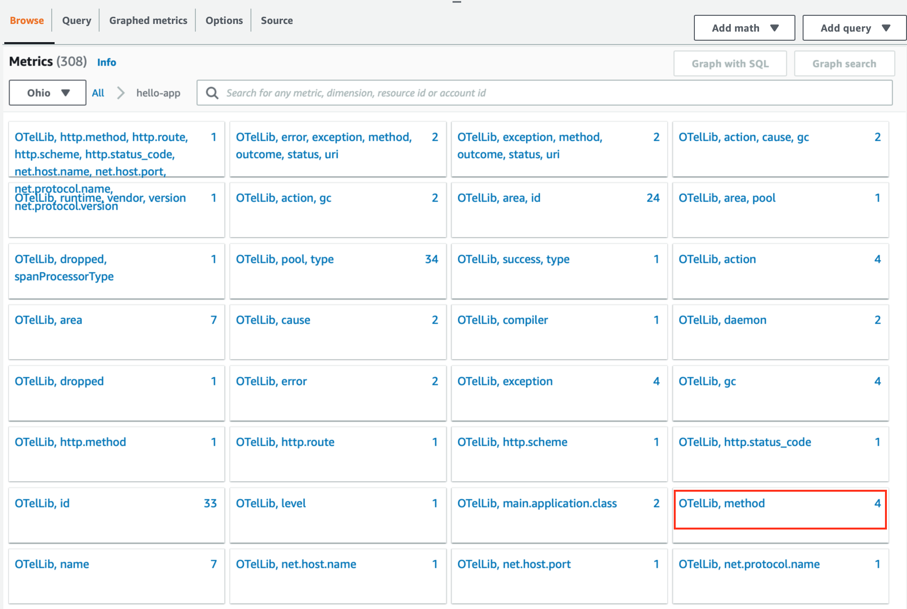

# Manual Instrumentation (Metrics to CloudWatch Metrics)

## 1. Update application code

1.1 Access to `instrumenting-java-apps-using-opentelemetry` project folder. 

```sh
cd instrumenting-java-apps-using-opentelemetry
```

1.3 Go to `src/main/java` folder. Update Java class `HelloAppController.java`

```java
package tutorial.buildon.aws.o11y;

import java.util.Objects;
import javax.annotation.PostConstruct;

import org.slf4j.Logger;
import org.slf4j.LoggerFactory;

import org.springframework.beans.factory.annotation.Value;
import org.springframework.web.bind.annotation.*;

import io.opentelemetry.api.GlobalOpenTelemetry;
import io.opentelemetry.api.metrics.LongCounter;
import io.opentelemetry.api.metrics.Meter;
import io.opentelemetry.api.trace.Span;
import io.opentelemetry.api.trace.Tracer;
import io.opentelemetry.context.Scope;
import io.opentelemetry.instrumentation.annotations.WithSpan;

import static tutorial.buildon.aws.o11y.Constants.*;
import static java.lang.Runtime.*;

@RestController
public class HelloAppController {

    private static final Logger log =
        LoggerFactory.getLogger(HelloAppController.class);

    @Value("otel.traces.api.version")
    private String tracesApiVersion;

    @Value("otel.metrics.api.version")
    private String metricsApiVersion;

    private final Tracer tracer =
        GlobalOpenTelemetry.getTracer("io.opentelemetry.traces.hello",
            tracesApiVersion);

    private final Meter meter =
        GlobalOpenTelemetry.meterBuilder("io.opentelemetry.metrics.hello")
            .setInstrumentationVersion(metricsApiVersion)
            .build();

    private LongCounter numberOfExecutions;

    @PostConstruct
    public void createMetrics() {

        numberOfExecutions =
            meter
                .counterBuilder(NUMBER_OF_EXEC_NAME)
                .setDescription(NUMBER_OF_EXEC_DESCRIPTION)
                .setUnit("int")
                .build();

        meter
            .gaugeBuilder(HEAP_MEMORY_NAME)
            .setDescription(HEAP_MEMORY_DESCRIPTION)
            .setUnit("byte")
            .buildWithCallback(
                r -> {
                    r.record(getRuntime().totalMemory() - getRuntime().freeMemory());
                });

    }

    @RequestMapping(method= RequestMethod.GET, value="/hello")
    public Response hello() {
        Response response = buildResponse();
        // Creating a custom span
        Span span = tracer.spanBuilder("mySpan").startSpan();
        try (Scope scope = span.makeCurrent()) {
            if (response.isValid()) {
                log.info("The response is valid.");
            }
            // Update the synchronous metric
            numberOfExecutions.add(1);
        } finally {
            span.end();
        }
        return response;
    }

    @WithSpan
    private Response buildResponse() {
        return new Response("Hello World");
    }

    private record Response (String message) {
        private Response {
            Objects.requireNonNull(message);
        }
        private boolean isValid() {
            return true;
        }
    }    
    
}
```

---

## 2. Deploy application

2.1 Create `hello-app` pod and service

```sh
kubectl apply -f ~/environment/workshop/5-auto-metrics-cloudwatch/hello-app
```
##### Result Output
```
deployment.apps/hello-app configured
service/hello-app unchanged
serviceaccount/hello-app unchanged
```

1.2 Check that application is ready with the following command

```sh
kubectl get po -n hello-app
```
##### Result Output
```
NAME                         READY   STATUS    RESTARTS   AGE
hello-app-cc7b5b55c-lg9f9   1/1     Running   0          10s
```

1.3 Check `hello-app` log

```sh
export HELLO_APP_POD_NAME=$(kubectl get pods -n hello-app -o jsonpath='{.items[].metadata.name}')
kubectl logs -f ${HELLO_APP_POD_NAME} -n hello-app
```
##### Result Output
```
OpenJDK 64-Bit Server VM warning: Sharing is only supported for boot loader classes because bootstrap classpath has been appended
[otel.javaagent 2023-10-15 18:20:29:567 +0000] [main] INFO io.opentelemetry.javaagent.tooling.VersionLogger - opentelemetry-javaagent - version: 1.30.0-aws
[otel.javaagent 2023-10-15 18:20:30:156 +0000] [main] INFO io.opentelemetry.sdk.resources.Resource - Attempting to merge Resources with different schemaUrls. The resulting Resource will have no schemaUrl assigned. Schema 1: https://opentelemetry.io/schemas/1.21.0 Schema 2: https://opentelemetry.io/schemas/1.20.0

  .   ____          _            __ _ _
 /\\ / ___'_ __ _ _(_)_ __  __ _ \ \ \ \
( ( )\___ | '_ | '_| | '_ \/ _` | \ \ \ \
 \\/  ___)| |_)| | | | | || (_| |  ) ) ) )
  '  |____| .__|_| |_|_| |_\__, | / / / /
 =========|_|==============|___/=/_/_/_/
 :: Spring Boot ::                (v3.1.2)

2023-10-15T18:20:35.911Z  INFO 1 --- [           main] tutorial.buildon.aws.o11y.HelloApp       : Starting HelloApp v1.0 using Java 17 with PID 1 (/usr/src/app/target/hello-app-1.0.jar started by root in /usr/src/app)
2023-10-15T18:20:35.921Z  INFO 1 --- [           main] tutorial.buildon.aws.o11y.HelloApp       : No active profile set, falling back to 1 default profile: "default"
2023-10-15T18:20:38.751Z  INFO 1 --- [           main] o.s.b.w.embedded.tomcat.TomcatWebServer  : Tomcat initialized with port(s): 8888 (http)
2023-10-15T18:20:38.808Z  INFO 1 --- [           main] o.apache.catalina.core.StandardService   : Starting service [Tomcat]
2023-10-15T18:20:38.809Z  INFO 1 --- [           main] o.apache.catalina.core.StandardEngine    : Starting Servlet engine: [Apache Tomcat/10.1.11]
2023-10-15T18:20:38.925Z  INFO 1 --- [           main] o.a.c.c.C.[Tomcat].[localhost].[/]       : Initializing Spring embedded WebApplicationContext
2023-10-15T18:20:38.926Z  INFO 1 --- [           main] w.s.c.ServletWebServerApplicationContext : Root WebApplicationContext: initialization completed in 2824 ms
2023-10-15T18:20:40.371Z  INFO 1 --- [           main] o.s.b.a.e.web.EndpointLinksResolver      : Exposing 1 endpoint(s) beneath base path '/actuator'
2023-10-15T18:20:40.588Z  INFO 1 --- [           main] o.s.b.w.embedded.tomcat.TomcatWebServer  : Tomcat started on port(s): 8888 (http) with context path ''
2023-10-15T18:20:40.636Z  INFO 1 --- [           main] tutorial.buildon.aws.o11y.HelloApp       : Started HelloApp in 5.596 seconds (process running for 11.386)
```

1.4 Open `new Terminal`


1.5 Access to `hello-app` pod and invoke the API

```sh
export HELLO_APP_POD_NAME=$(kubectl get pods -n hello-app -o jsonpath='{.items[].metadata.name}')
kubectl exec -it ${HELLO_APP_POD_NAME}  -n hello-app -- sh
```

1.6 Invoke API inside Pod `sh`
```sh
curl -X GET http://localhost:8888/hello
```
##### Result Output
```
{"message":"Hello World"}
```

---

## 2. CloudWatch Metrics

2.1 Open Cloudwatch [Metrics -> All metrics](https://console.aws.amazon.com/cloudwatch/home)

In `Browse` tab, you will see `hello-app` shows in the `Custom namespaces`. Select on `hello-app`


2.2 Select metrics: `OTelLib, method` 



2.3 You will list of `Metrics`

Select metrics name: `http.server.requests`, You 


2.4 You will see `Segment Timelines` detail as belows


Congratulations!! You have completed this section. Please continue on [Environment Variable](6-environment-variable.md)

---

## References
- [Using CloudWatch Metrics with AWS Distro for OpenTelemetry](https://aws-otel.github.io/docs/getting-started/cloudwatch-metrics)
---