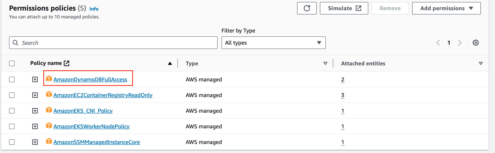

# Microservices distributed tracing with Opentelemetry through X-Ray


## 1. Create an ECR Repository

1.1 In the AWS Management Console, navigate to `Amazon ECR`.


1.2 Click on `Repository` and `Create repository`.


1.3 Create an ECR repository `bookcatalogue`. 


1.4 Under Image scan setting, enable Scan on push, and enable KMS encryption.


1.5 Once the repository is created, select the repository and click `View push commands`


Repeat these step to create more 2 repository which are `bookinventory` and `bookrecommendation`

---

## 2. Install Amazon Corretto 17 (OpenJDK Runtime Environment Corretto-17.0.8.8.1)

2.1 To use the Corretto Apt repositories on Debian-based systems, such as Ubuntu, import the Corretto public key and then add the repository to the system list by using the following commands:

```bash
 wget -O- https://apt.corretto.aws/corretto.key | sudo apt-key add - 
 sudo add-apt-repository 'deb https://apt.corretto.aws stable main'
```

2.2 After the repo has been added, you can install Corretto 17 by running this command:

```bash
sudo apt-get update; sudo apt-get install -y java-17-amazon-corretto-jdk
```

2.3 Press `Enter` on all pop up messages

```bash
java --version
```
##### Result Output
```
openjdk version "17.0.8.1" 2023-08-22 LTS
OpenJDK Runtime Environment Corretto-17.0.8.8.1 (build 17.0.8.1+8-LTS)
OpenJDK 64-Bit Server VM Corretto-17.0.8.8.1 (build 17.0.8.1+8-LTS, mixed mode, sharing)
```

## 3. Build, tag and push your container image to the ECR repository

3.1 Generate a Docker Image for `bookcatalogue`

```sh
cd ~/environment/adot-eks/workshop/9-tracing-with-micronaut/src/micronaut-microservices-distributed-tracing-xray-gradle-java/bookcatalogue
chmod 777 gradlew
./gradlew dockerBuild
```

Generate a Docker Image for `bookinventory`

```sh
cd ../bookinventory
chmod 777 gradlew
./gradlew dockerBuild
```

Generate a Docker Image for `bookrecommendation`

```sh
cd ../bookrecommendation
chmod 777 gradlew
./gradlew dockerBuild
```

3.2 Authenticate your Docker client to your registry

```sh
aws ecr get-login-password --region ${AWS_REGION} | docker login --username AWS --password-stdin ${ACCOUNT_ID}.dkr.ecr.${AWS_REGION}.amazonaws.com
```
##### Result Output
```
WARNING! Your password will be stored unencrypted in /home/ec2-user/.docker/config.json.
Configure a credential helper to remove this warning. See
https://docs.docker.com/engine/reference/commandline/login/#credentials-store

Login Succeeded
```

3.3 Tag your `bookcatalogue`, `bookinventory`, `bookrecommendation` images built in the previous section

```sh
docker tag bookcatalogue:latest ${ACCOUNT_ID}.dkr.ecr.${AWS_REGION}.amazonaws.com/bookcatalogue:latest
docker tag bookinventory:latest ${ACCOUNT_ID}.dkr.ecr.${AWS_REGION}.amazonaws.com/bookinventory:latest
docker tag bookrecommendation:latest ${ACCOUNT_ID}.dkr.ecr.${AWS_REGION}.amazonaws.com/bookrecommendation:latest
```

3.4 Push the image to ECR

```sh
docker push ${ACCOUNT_ID}.dkr.ecr.${AWS_REGION}.amazonaws.com/bookcatalogue:latest
docker push ${ACCOUNT_ID}.dkr.ecr.${AWS_REGION}.amazonaws.com/bookinventory:latest
docker push ${ACCOUNT_ID}.dkr.ecr.${AWS_REGION}.amazonaws.com/bookrecommendation:latest
```

---

## 4. Update ADOT Collector

4.1 Update the ADOT Collector

```sh
cd ~/environment
sed -i -e s/\<AWS_REGION\>/${AWS_REGION}/g ~/environment/adot-eks/workshop/9-tracing-with-micronaut/k8s/otel-collector-config.yaml
kubectl apply -f ~/environment/adot-eks/workshop/9-tracing-with-micronaut/k8s/otel-collector-config.yaml
```
##### Result Output
```sh
opentelemetrycollector.opentelemetry.io/my-adot-collector configured
```

4.2 Opentelemetry Configuration Details. We will change only `log_stream_name`

```yaml
        log_stream_name: 'otel-using-java-micronaut'
```

4.3 Check Opentelemetry Collector Pod Log

```sh
export OTEL_COLLECTOR_POD_NAME=$(kubectl get pods -n otel -o jsonpath='{.items[].metadata.name}')
kubectl logs -f $OTEL_COLLECTOR_POD_NAME -n otel
```


## 5. Update IAM Policy to access DynamoDB

5.1 On `Roles` menu, search for `NodegroupDefault` then Select into role that show in the list


5.2 On `Add permissions`, select `Attach policies`


5.3 Search for `dynamo` and check on `AmazonDynamoDBFullAccess` then click on `Add permissions`


5.4 `AmazonDynamoDBFullAccess` will show on the list



## 6. Deploy microservices

6.1 Create `bookcatalogue` `bookinventory` `bookrecommendation` namespace

```sh
cd ~/environment/
kubectl apply -f ~/environment/adot-eks/workshop/9-tracing-with-micronaut/k8s/namespace.yaml
```
##### Result Output
```
namespace/bookcatalogue created
namespace/bookinventory created
namespace/bookrecommendation created
```

6.2 Create `bookcatalogue` `bookinventory` `bookrecommendation` pod and service

```sh
sed -i -e s/\<AWS_REGION\>/${AWS_REGION}/g -e s/\<ACCOUNT_ID\>/${ACCOUNT_ID}/g ~/environment/adot-eks/workshop/9-tracing-with-micronaut/k8s/bookcatalogue/deployment.yaml
sed -i -e s/\<AWS_REGION\>/${AWS_REGION}/g -e s/\<ACCOUNT_ID\>/${ACCOUNT_ID}/g ~/environment/adot-eks/workshop/9-tracing-with-micronaut/k8s/bookinventory/deployment.yaml
sed -i -e s/\<AWS_REGION\>/${AWS_REGION}/g -e s/\<ACCOUNT_ID\>/${ACCOUNT_ID}/g ~/environment/adot-eks/workshop/9-tracing-with-micronaut/k8s/bookrecommendation/deployment.yaml
kubectl apply -f ~/environment/adot-eks/workshop/9-tracing-with-micronaut/k8s/bookcatalogue
kubectl apply -f ~/environment/adot-eks/workshop/9-tracing-with-micronaut/k8s/bookinventory
kubectl apply -f ~/environment/adot-eks/workshop/9-tracing-with-micronaut/k8s/bookrecommendation
```
##### Result Output
```
deployment.apps/bookcatalogue created
service/bookcatalogue created

deployment.apps/bookinventory created
service/bookinventory created

deployment.apps/bookrecommendation created
service/bookrecommendation created
```

6.3 Check that application is ready with the following command

```sh
kubectl get po -A | grep book
```
##### Result Output
```
bookcatalogue                   bookcatalogue-6f4d46b774-tqd89                                    1/1     Running   0            2m20s
bookinventory                   bookinventory-5776db9899-hfk4l                                    1/1     Running   0            8m31s
bookrecommendation              bookrecommendation-5bfc7744fb-s52br                               1/1     Running   0            8m30s
```

6.4 Check `bookcatalogue` log

```sh
export BOOK_CATALOGUE_POD_NAME=$(kubectl get pods -n bookcatalogue -o jsonpath='{.items[].metadata.name}')
kubectl logs -f ${BOOK_CATALOGUE_POD_NAME} -n bookcatalogue
```
##### Result Output
```
 __  __ _                                  _   
|  \/  (_) ___ _ __ ___  _ __   __ _ _   _| |_ 
| |\/| | |/ __| '__/ _ \| '_ \ / _` | | | | __|
| |  | | | (__| | | (_) | | | | (_| | |_| | |_ 
|_|  |_|_|\___|_|  \___/|_| |_|\__,_|\__,_|\__|
16:24:14.700 [main] INFO  i.m.c.DefaultApplicationContext$RuntimeConfiguredEnvironment - Established active environments: [k8s, cloud]
16:24:16.313 [main] INFO  io.micronaut.runtime.Micronaut - Startup completed in 3304ms. Server Running: http://bookcatalogue-6f4d46b774-tqd89:8080
Oct 17, 2023 4:24:38 PM io.opentelemetry.api.GlobalOpenTelemetry maybeAutoConfigureAndSetGlobal
INFO: AutoConfiguredOpenTelemetrySdk found on classpath but automatic configuration is disabled. To enable, run your JVM with -Dotel.java.global-autoconfigure.enabled=true
```

`bookinventory`

```sh
export BOOK_INVENTORY_POD_NAME=$(kubectl get pods -n bookinventory -o jsonpath='{.items[].metadata.name}')
kubectl logs -f ${BOOK_INVENTORY_POD_NAME} -n bookinventory
```

`bookrecommendation`

```sh
export BOOK_RECOMMENDATION_POD_NAME=$(kubectl get pods -n bookrecommendation -o jsonpath='{.items[].metadata.name}')
kubectl logs -f ${BOOK_RECOMMENDATION_POD_NAME} -n bookrecommendation
```

6.5 Open `new Terminal`


6.6 Access to `hello-app` pod and invoke the API

```sh
kubectl run mycurlpod --image=curlimages/curl -i --tty -- sh
```

```sh
curl -X GET http://bookrecommendation.bookrecommendation:8080/books
```
##### Result Output
```
[{"name":"Building Microservices"},{"name":"Continuous Delivery"},{"name":"Release It!"}]
```

---

## References
- [MICROSERVICES DISTRIBUTED TRACING WITH OPENTELEMETRY THROUGH X-RAY AND THE MICRONAUT FRAMEWORK](https://guides.micronaut.io/latest/micronaut-microservices-distributed-tracing-xray-gradle-java.html)
- [BUILDING A DOCKER IMAGE OF YOUR MICRONAUT APPLICATION](https://guides.micronaut.io/latest/micronaut-docker-image-gradle-java.html)
- [Amazon Corretto 17 Installation Instructions for Debian-Based, RPM-Based and Alpine Linux Distributions](https://docs.aws.amazon.com/corretto/latest/corretto-17-ug/generic-linux-install.html)

---

