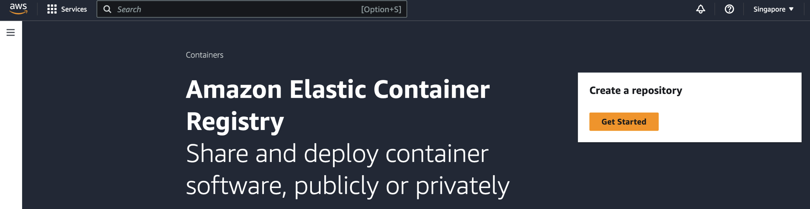
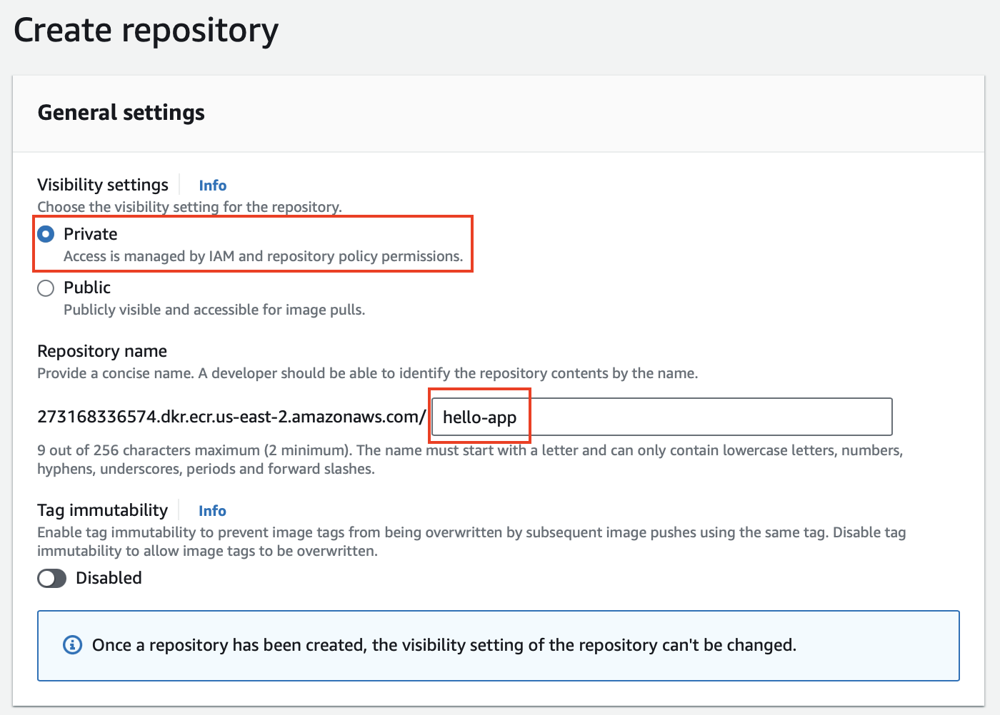
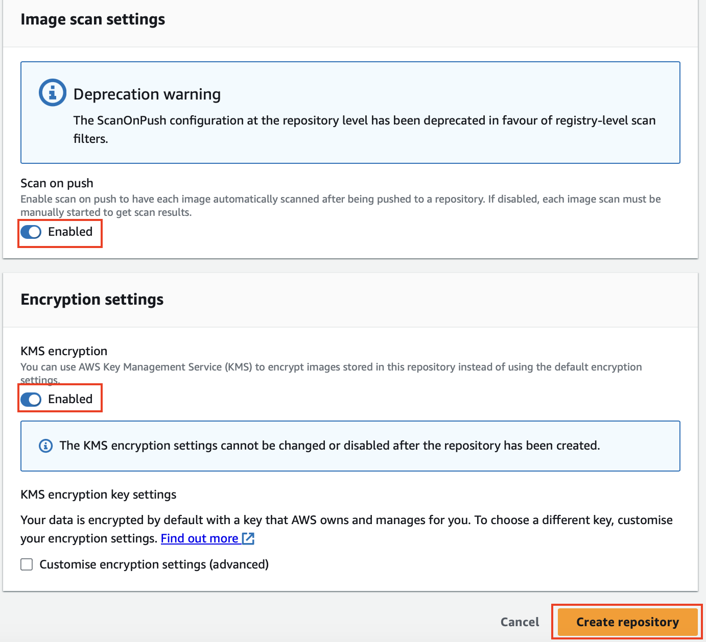
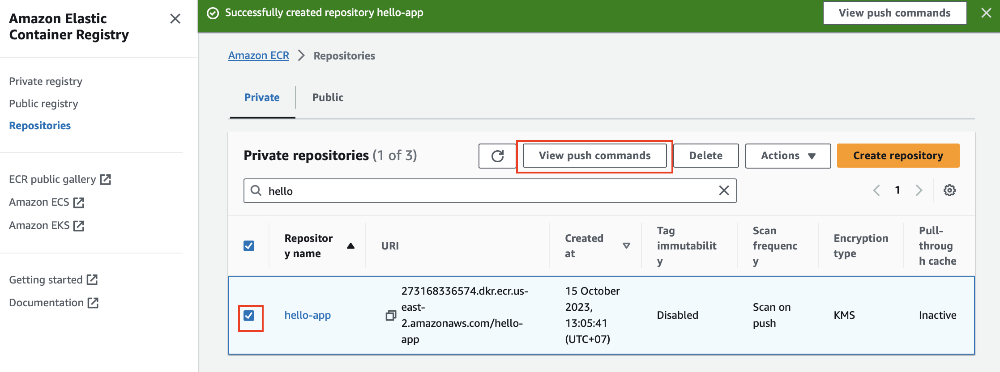
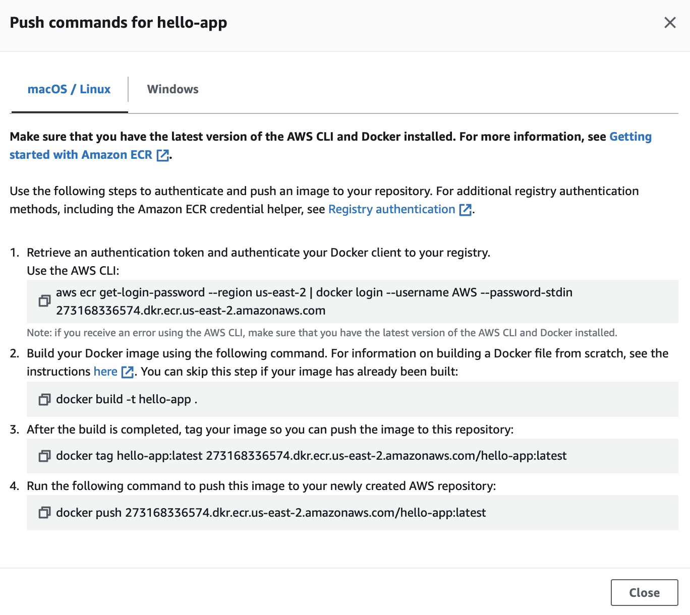

# Running Application on EKS

## 1. Create an ECR Repository

1.1 In the AWS Management Console, navigate to `Amazon ECR`.


1.2 Click on `Get Started` to create a repository.



1.3 Create an ECR repository `hello-app`. 



1.4 Under Image scan setting, enable Scan on push, and enable KMS encryption.



1.5 Once the repository is created, select the repository and click `View push commands`



You'd see the commands to authenticate, tag, and push your container immages to the ECR repository.



## 2. Tag and push your container image to the ECR repository

In your Cloud9 environment, follow the instructions from the push commands.

2.1 Authenticate your Docker client to your registry

```sh
aws ecr get-login-password --region ${AWS_REGION} | docker login --username AWS --password-stdin ${ACCOUNT_ID}.dkr.ecr.${AWS_REGION}.amazonaws.com
```
##### Result Output
```
WARNING! Your password will be stored unencrypted in /home/ec2-user/.docker/config.json.
Configure a credential helper to remove this warning. See
https://docs.docker.com/engine/reference/commandline/login/#credentials-store

Login Succeeded
```

2.2 Create Dockerfile

```sh
touch Dockerfile
```

2.3 Update content in docker file

```sh
FROM maven:3.8.1-openjdk-17-slim

VOLUME /tmp
ADD . /usr/src/app
WORKDIR /usr/src/app

RUN mvn clean package -DskipTests
RUN curl -L https://github.com/aws-observability/aws-otel-java-instrumentation/releases/download/v1.28.1/aws-opentelemetry-agent.jar --output opentelemetry-javaagent-all.jar
ENTRYPOINT [ "java", "-javaagent:opentelemetry-javaagent-all.jar", "-jar", "target/hello-app-1.0.jar" ]
```

2.4 Build to docker image

```sh
docker build -t hello-app:latest .
```

2.5 Tag your `hello-app` image built in the previous section

```sh
docker tag hello-app:latest ${ACCOUNT_ID}.dkr.ecr.${AWS_REGION}.amazonaws.com/hello-app:latest
```

2.6 Push the image to ECR
```sh
docker push ${ACCOUNT_ID}.dkr.ecr.${AWS_REGION}.amazonaws.com/hello-app:latest
```

## 3. Deploy application

3.1 Create `hello-app` namespace

```sh
kubectl apply -f ~/environment/hello-app/namespace.yaml 
```

3.2 Create `hello-app` pod and service

```
kubectl apply -f ./hello-app
```

3.3 Create `hello-app` pod and service

```
kubectl apply -f ./hello-app
```

3.4 Check that application is ready with the following command

```sh
kubectl get po -n hello-app
```
##### Result Output
```
NAME                         READY   STATUS    RESTARTS   AGE
hello-app-5887979795-8ldn7   1/1     Running   0          10s
```

Congratulations!! You have completed this section. Please continue on [Running Application on EKS](2_eks_app.md)

---

## References
- [Containers Zero to One Workshop](https://catalog.us-east-1.prod.workshops.aws/workshops/613d57e0-6ae0-4fdc-bdb8-dac3930c2ec9/en-US)
---